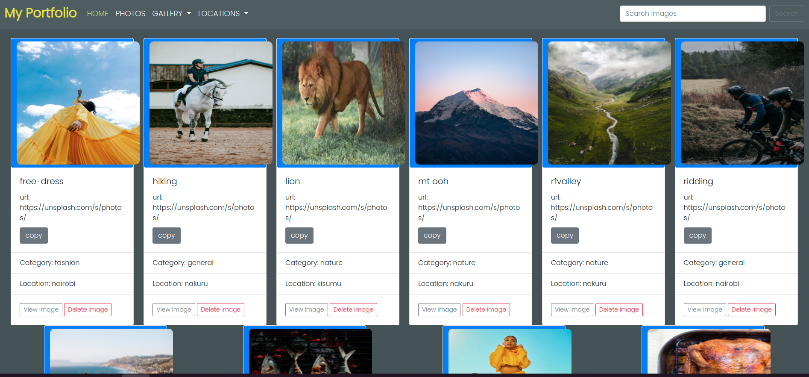

### PROJECT NAME

My-Portfolio

## SCREENSHOT

### :bulb: PROJECT DESCRIPTION

This is a simple Django program that allows a user to view various photos fro different locations. the user can search for photos according to their category and also copy the link to the photos url. photos acn also be viewed according to the loaction they were taken too.

### :pushpin:USER STORIES
- A user can see different photos on the homepage.
- a user can copy the link to the photos url.
- A user can delete  a photo.
- A user can  click on the image to view it's details. 
- A user can view a lager version of the photo too.

### :pushpin:PROJECT SETUP INSTRUCTIONS

- Open terminal {Ctrl +Alt + T}
- git clone https://github.com/lcmongwe/portfolio.git
- cd myblog
- code . or atom . depending on your text editor
- python3 manage.py runserver

### :computer: TECHNOLOGIES USED

- PYTHON
- HTML,CSS and Bootstrap
- Django Framework
- Postrgressql
- MARKDOWN
- Heroku

### :pushpin: KNOWN BUGS
No known bugs so far

### :telephone_receiver: CONTACT INFORMATION

Have any questions? reach me on:

1. Twitter : @lucy_Mongwe
2. faceboook : Lucy Mongwe
3. Email : lcmongwe@gmail.com

## licence
MIT licence
copyright(c)2022 Lucy Mongwe